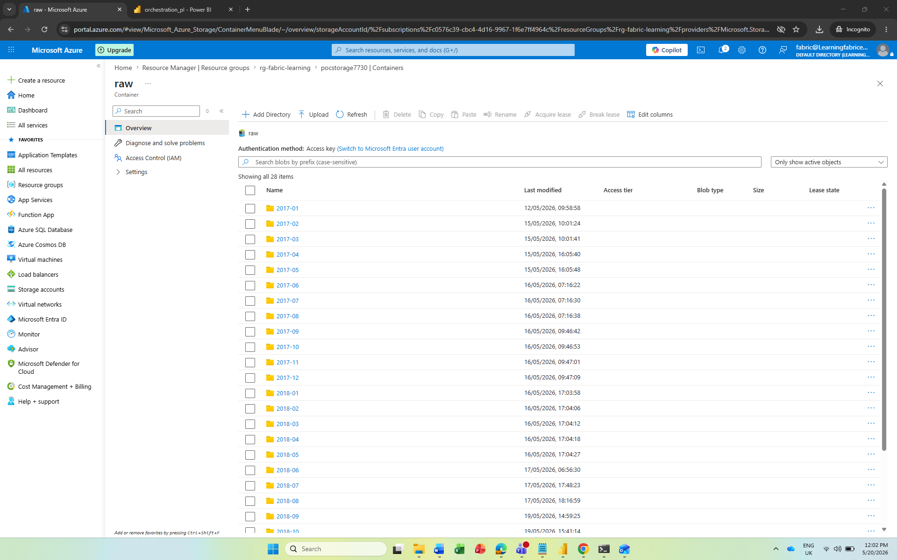
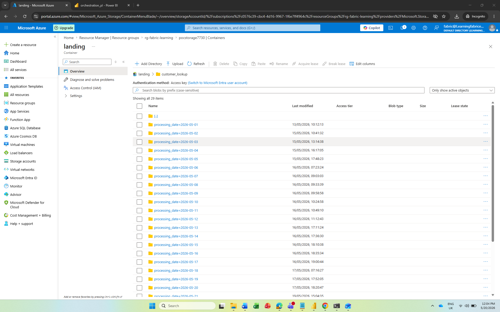
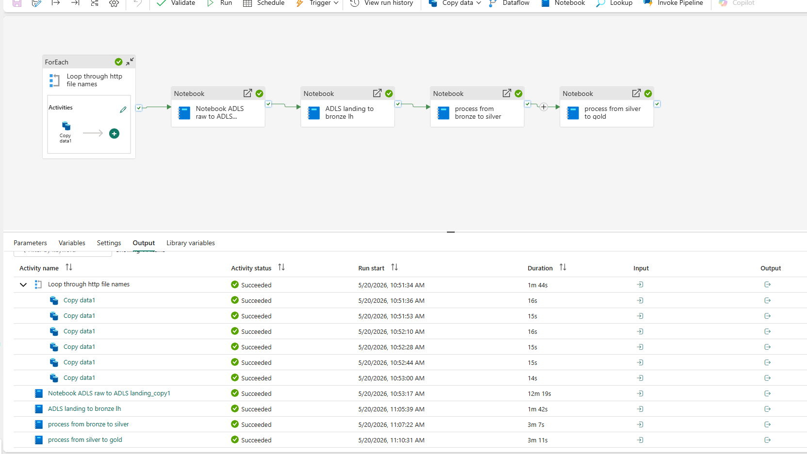
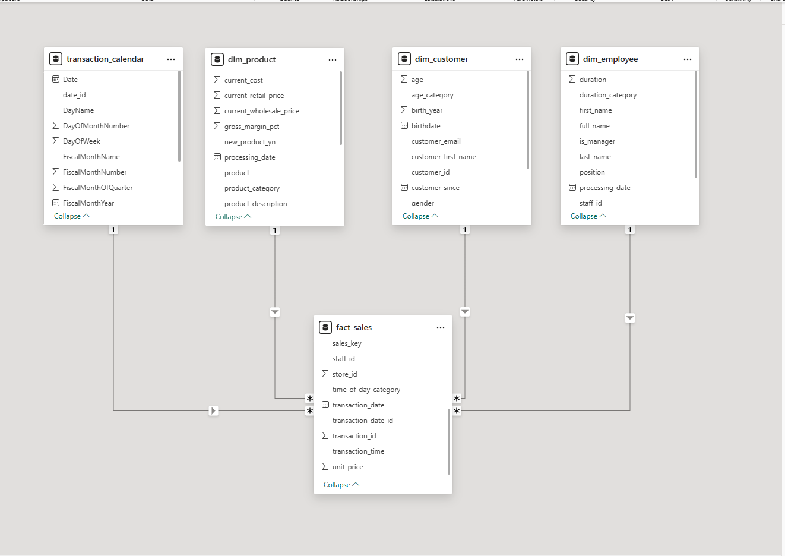
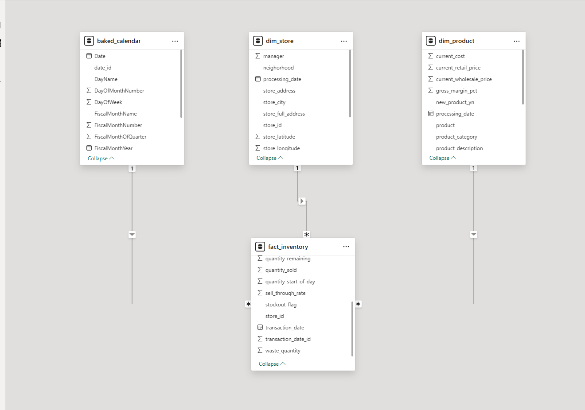

# ☕ BrewTrack Analytics

> End-to-end data engineering pipeline built on Microsoft Fabric and Azure Data Lake Storage Gen2, serving analytical-ready semantic models in Power BI.


---

## 📋 Table of Contents

- [Project Overview](#project-overview)
- [Business Problem](#business-problem)
- [Solution Architecture](#solution-architecture)
- [Technology Stack](#technology-stack)
- [Pipeline Layers Explained](#pipeline-layers-explained)
- [Orchestration](#orchestration)
- [Data Model](#data-model)
- [Key Engineering Decisions](#key-engineering-decisions)
- [Semantic Models](#semantic-models)
- [Analytical Findings](#analytical-findings)
- [Project Structure](#project-structure)
- [How to Run](#how-to-run)
- [Documentation](#documentation)

---

## Project Overview

BrewTrack Analytics is a fully automated, end-to-end data engineering pipeline built for a fictional US-based coffee and baked goods retail chain operating across three New York store locations. The project demonstrates real-world data engineering practices: ingesting raw operational data from a remote HTTP source, processing it through a layered Medallion Architecture (Raw > Landing > Bronze > Silver > Gold), and serving analytical-ready semantic models in Power BI.

| | |
|---|---|
| **Industry** | Food and beverage retail |
| **Stores** | 3 locations across New York (Astoria, Lower Manhattan, Hell's Kitchen) |
| **Pipeline layers** | 5 (Raw · Landing · Bronze · Silver · Gold) |
| **Gold tables produced** | 8 (2 fact · 4 dimension · 2 calendar) |
| **Full pipeline run time** | ~19 minutes (all activities succeeded) |
| **Semantic models** | 2 (Sales · Inventory) |
| **Platform** | Microsoft Fabric · Azure Data Lake Storage Gen2 |

---

## Business Problem

The business faced five operational data challenges that directly impacted profitability and decision-making.

### 1. Fragmented and siloed operational data
Sales, inventory, customer, employee, product, and store data were generated daily across three stores but stored in separate flat files with no unified view. Analysts could not answer cross-functional questions such as: *Which stores are selling out of top products before closing time?*

### 2. No incremental data loading strategy
Without a mechanism for tracking which data had already been processed, every pipeline run risked either reprocessing all historical data (costly and slow) or missing new records entirely. This led to stale dashboards and duplicated analytical workloads.

### 3. Poor data quality upstream
Source files contained inconsistent date formats, duplicate records, invalid email addresses, missing primary keys, and non-standardised categorical values (e.g. gender encoded as `m`, `M`, `Male`, `MALE`). These issues compounded across millions of rows and produced misleading reports.

### 4. No single source of truth for inventory
Store managers lacked a consolidated view of daily inventory levels, stockout events, waste quantities, and sell-through rates. Restocking decisions were made reactively rather than from data.

### 5. No customer or employee analytics capability
The business held valuable data on customer loyalty, purchase behaviour, and employee tenure but had no analytical layer to surface insights such as age-group purchasing patterns, loyalty card engagement, or staff-to-sales performance.

---

## Solution Architecture

```
┌─────────────────────────────────────────────────────────────────────┐
│                      ORCHESTRATION LAYER                            │
│           Microsoft Fabric Data Pipeline (Parameterised)            │
│  ForEach Loop > Copy Data > Notebook (x4) · Automated daily run     │
└───────────────────────────┬─────────────────────────────────────────┘
                            │
          ┌─────────────────▼──────────────────┐
          │          SOURCE LAYER               │
          │    HTTP Source (GitHub)             │
          │    6 CSV files per batch_month      │
          └─────────────────┬──────────────────┘
                            │
          ┌─────────────────▼──────────────────┐
          │          RAW LAYER                  │
          │    Azure Data Lake Storage Gen2     │
          │    CSV · partitioned by batch_month │
          │    28 monthly folders               │
          └─────────────────┬──────────────────┘
                            │
          ┌─────────────────▼──────────────────┐
          │          LANDING LAYER              │
          │    Azure Data Lake Storage Gen2     │
          │    Parquet · processing_date added  │
          │    Partitioned by processing_date   │
          │    Incremental load pattern         │
          └─────────────────┬──────────────────┘
                            │
          ┌─────────────────▼──────────────────┐
          │          BRONZE LAYER               │
          │    Microsoft Fabric Lakehouse       │
          │    Delta Lake · Schema applied      │
          │    6 tables · Latest partition only │
          └─────────────────┬──────────────────┘
                            │
          ┌─────────────────▼──────────────────┐
          │          SILVER LAYER               │
          │    Microsoft Fabric Lakehouse       │
          │    5-point DQ framework             │
          │    Delta MERGE (UPSERT logic)       │
          │    6 clean, validated tables        │
          └─────────────────┬──────────────────┘
                            │
          ┌─────────────────▼──────────────────┐
          │          GOLD LAYER                 │
          │    Microsoft Fabric Lakehouse       │
          │    Star schema · 8 tables           │
          │    Business enrichment              │
          │    SHA-256 surrogate keys           │
          └────────┬─────────────────┬──────────┘
                   │                 │
     ┌─────────────▼──┐     ┌────────▼───────────┐
     │ Sales Semantic  │     │ Inventory Semantic  │
     │ Model           │     │ Model               │
     │ fact_sales      │     │ fact_inventory      │
     │ + 4 dimensions  │     │ + 3 dimensions      │
     └─────────────────┘     └────────────────────┘
                   │                 │
          ┌────────▼─────────────────▼──────────┐
          │    Power BI Reports & Dashboards     │
          │    Sales Performance Report          │
          │    Inventory Health Report           │
          └─────────────────────────────────────┘
```

---

## Technology Stack

| Component | Tool / Service |
|---|---|
| Cloud storage | Azure Data Lake Storage Gen2 (ADLS) |
| Compute and processing | Microsoft Fabric (Spark Notebooks) |
| Orchestration | Microsoft Fabric Data Pipeline |
| Data format (Landing) | Apache Parquet |
| Data format (Lakehouse) | Delta Lake |
| Transformation language | PySpark (Python) |
| Data modelling | Microsoft Fabric Lakehouse (OneLake) |
| Semantic layer | Power BI Semantic Models |
| Source data | HTTP / GitHub (CSV files) |

---

## Pipeline Layers Explained

### Raw ADLS Container

Six CSV files are ingested from an HTTP source (GitHub) per `batch_month` using the Fabric Data Pipeline ForEach loop with a Copy data activity. Files ingested per batch:

- `customer_lookup`
- `employee_lookup`
- `food_inventory`
- `product_lookup`
- `sales_by_store`
- `store_lookup`

Files land in ADLS under month-partitioned folders (e.g. `2017-01/`, `2017-02/`).

**Outcome:** 28 monthly batch folders successfully ingested into the raw ADLS container.

Raw ADLS container showing 28 month-partitioned folders from 2017-01 to 2018-10 in the Azure Portal


*Raw ADLS container · pocstorage7730 · 28 batch_month partitions (2017-01 to 2019-07) · All folders created by the Fabric Data Pipeline ForEach loop Copy data activity*

---

### Landing ADLS Container

The PySpark notebook `raw_ADLS_to_landing_ADLS` reads each CSV from the raw container, validates the file contains data before processing, appends a `processing_date` column (passed as a pipeline parameter), and writes the output as Parquet partitioned by `processing_date` to the landing container.

This is the core of the **incremental load pattern**: each daily pipeline run creates one new partition without touching historical data. Notebooks in subsequent layers filter to `processing_date == today_date`, ensuring only that day's batch is processed.

**Outcome:** 29 daily `processing_date` partitions created under the `customer_lookup` folder in the landing container, each representing one daily pipeline run.

Landing ADLS container showing customer_lookup folder with 29 processing_date partitions


*Landing ADLS container · customer_lookup · 29 processing_date partitions. Incremental load pattern confirmed · Each partition = one daily pipeline run*

---

### Bronze Lakehouse

The `landing_to_bronze_lh` PySpark notebook reads Parquet files from the landing ADLS container, filtered to the latest `processing_date`. It writes Delta tables to the Bronze Fabric Lakehouse, applying schema and providing a clean, queryable layer before transformation begins.

**Run time:** 1 minute 42 seconds

---

### Silver Lakehouse

The `bronze_to_silver` PySpark notebook applies a structured **5-point data quality framework** across all 6 datasets:

1. **Deduplication** — using meaningful key combinations (e.g. `customer_id + customer_since + birthdate`)
2. **Null checks** — on primary key columns; rows failing null checks are dropped and logged
3. **Data type casting** — to appropriate types (INT, DATE, DECIMAL, STRING)
4. **Standardisation** — whitespace trimming, lowercase column headers, title-case string values, multi-format date normalisation (`yyyy-MM-dd`, `MM/dd/yyyy`, `dd-MM-yyyy`), categorical value standardisation (e.g. gender: `m`, `M`, `Male`, `MALE` → `M`)
5. **Business rule validation** — email format checks, date boundary checks (no future dates, no pre-1900 dates), Boolean enforcement (`Y`/`N` flags)

All tables are loaded using **Delta Lake MERGE (UPSERT)** logic:
- `WHEN MATCHED` → update existing records
- `WHEN NOT MATCHED` → insert new records

**Run time:** 3 minutes 7 seconds | **Tables produced:** `customer_silver`, `employee_silver`, `product_silver`, `sales_silver`, `store_silver`, `food_inventory_silver`

---

### Gold Lakehouse

The `silver_to_gold` PySpark notebook applies business enrichment logic and produces 8 tables in a star schema.

**Run time:** 3 minutes 11 seconds

| Table | Type | Key derived fields | Row count |
|---|---|---|---|
| `fact_sales` | Fact | SHA-256 `sales_key` · `transaction_date_id` · `time_of_day_category` · `revenue` | 1,000 |
| `fact_inventory` | Fact | SHA-256 `inventory_id` · `days_since_baked` · `is_fresh` · `sell_through_rate` · `stockout_flag` · `waste_quantity` | 1,000 |
| `dim_customer` | Dimension | `age` · `age_category` (18-25, 26-35, 36-50, 51-65, 65+) | 1,000 |
| `dim_employee` | Dimension | `full_name` · `duration` · `duration_category` · `is_manager` | 25 |
| `dim_product` | Dimension | `gross_margin_pct` · `product_group` · `product_category` | 80 |
| `dim_store` | Dimension | `store_full_address` · `neighorhood` · geolocation coordinates | 3 |
| `transaction_calendar` | Calendar | `FiscalYear` · `FiscalQuarter` · `FiscalMonthName` · `DayName` · `date_id` | 1,000 |
| `baked_calendar` | Calendar | `FiscalYear` · `FiscalQuarter` · `FiscalMonthName` · `DayName` · `date_id` | 1,000 |

---

## Orchestration

The entire pipeline is driven by a single **Microsoft Fabric Data Pipeline** with 10 parameterised inputs. The screenshot below shows a successful full end-to-end run on 20/05/2026, completing in under 20 minutes with all activities succeeding.

Microsoft Fabric Data Pipeline showing ForEach loop and 4 notebook activities all with green succeeded ticks and a run log with activity names and durations


*Microsoft Fabric Data Pipeline · ForEach loop (6 files · 14-16s each) · Notebook ADLS raw to landing (12m 19s) · ADLS landing to bronze lh (1m 42s) · Process from bronze to silver (3m 7s) · Process from silver to gold (3m 11s) · All activities: Succeeded*

### Pipeline parameters

| Parameter | Type | Description |
|---|---|---|
| `batch_month` | String | Monthly batch to process — e.g. `2017-01` |
| `processed_date` | String | Date appended to landing files as the partition key |
| `today_date` | String | Used in Silver and Gold notebooks to filter to the latest batch |
| `p_file_name` | Array | `["customer_lookup","employee_lookup","food_inventory","product_lookup","sales_by_store","store_lookup"]` |
| `source_account` | String | Source ADLS storage account name |
| `source_container` | String | Source ADLS container name (`raw`) |
| `destination_account` | String | Destination ADLS storage account name |
| `destination_container` | String | Destination ADLS container name (`landing`) |
| `workspace` | String | Microsoft Fabric workspace ID |
| `lakehouse` | String | Target Fabric Lakehouse ID |

### Pipeline activity flow

```
ForEach loop (Loop through http file names)
│
│  ┌─ Copy data1 (customer_lookup)   · 16s · Succeeded
│  ├─ Copy data1 (employee_lookup)   · 15s · Succeeded
│  ├─ Copy data1 (food_inventory)    · 16s · Succeeded
│  ├─ Copy data1 (product_lookup)    · 15s · Succeeded
│  ├─ Copy data1 (sales_by_store)    · 15s · Succeeded
│  └─ Copy data1 (store_lookup)      · 14s · Succeeded
│
├── Notebook: ADLS raw to landing    · 12m 19s · Succeeded
├── Notebook: ADLS landing to bronze · 1m  42s · Succeeded
├── Notebook: Bronze to silver       · 3m  07s · Succeeded
└── Notebook: Silver to gold         · 3m  11s · Succeeded

Total pipeline run time: ~19 minutes · All activities: Succeeded
```

---

## Data Model

### Sales Semantic Model




### Inventory Semantic Model




All relationships are Many-to-One from the fact table to the dimension table. Join keys are documented in the 
[Data Dictionary](docs/data dictionary.md).

---

## Key Engineering Decisions

**Incremental loading via `processing_date` partitioning**
Rather than full reloads, each notebook filters on `processing_date == today_date`. This supports daily scheduled runs without reprocessing historical data and keeps pipeline run times predictable.

**UPSERT (MERGE) over append or overwrite**
Using Delta Lake MERGE logic allows the pipeline to handle both new records and corrections to existing records without duplicating data. This is critical for slowly changing dimensions like customer and product data.

**Try/Except table creation pattern**
Silver and Gold notebooks attempt to read an existing Delta table; if it does not exist, they create it with an explicit schema before running the MERGE. This makes the pipeline idempotent and safe to run on first execution without manual setup.

**SHA-256 surrogate key generation**
Rather than relying on a potentially non-unique `transaction_id`, composite surrogate keys (`sales_key`, `inventory_id`) are generated using SHA-256 hashing across multiple columns. This guarantees row-level uniqueness for MERGE operations in both fact tables.

**ForEach loop with array parameter**
HTTP ingestion is driven by a `p_file_name` array parameter passed to a ForEach loop, making it straightforward to add new source files without restructuring the pipeline.

---

## Semantic Models

Two Power BI semantic models are served directly from the Gold Lakehouse via OneLake.

### Sales Semantic Model

Connects `fact_sales` to `dim_product`, `dim_customer`, `dim_employee`, `dim_store`, and `transaction_calendar`. Supports analysis of revenue, transaction volume, product mix, customer demographics, time-of-day trading patterns, and staff performance.


*Sales semantic model · Power BI · fact_sales at centre · connected to transaction_calendar, dim_product, dim_customer, dim_employee · All relationships Many-to-One · join via date_id, product_id, customer_id, staff_id*

---

### Inventory Semantic Model

Connects `fact_inventory` to `dim_product`, `dim_store`, and `baked_calendar`. Supports analysis of daily stock levels, sell-through rates, waste quantities, freshness, and stockout events across all three store locations.


*Inventory semantic model · Power BI · fact_inventory at centre · connected to baked_calendar, dim_store, dim_product · All relationships Many-to-One · join via date_id, store_id, product_id*

---

## Analytical Findings

### Sales Performance

| Metric | Value |
|---|---|
| Total revenue | $4,533 |
| Total transactions | 778 |
| Total line items | 1,000 |
| Avg revenue per line item | $4.53 |
| Beverage revenue share | 89% ($4,048) |
| Food revenue share | 11% ($485) |
| Peak trading period | Morning ($1,522) |
| Lowest trading period | Evening ($248 — 16% of morning) |
| Highest-value customer segment | 36-50 age group ($524) |
| Takeaway vs in-store split | 50.3% takeaway · 49.7% in-store |
| Top staff by revenue | Brittani Jorden ($1,356) |

### Inventory Health

| Metric | Value |
|---|---|
| Avg sell-through rate | 24.9% (target: 70%+) |
| Total waste units | 14,952 |
| Waste from stale stock | 100% (0 units from fresh stock) |
| Highest waste store | Lower Manhattan (5,470 units) |
| Stockout events | 2 (0.2% of 1,000 records) |
| Recommended bake reduction | 40-50% (stockout risk remains minimal) |

> **Key finding:** The business is producing roughly 4x what it sells daily. A same-day baking policy would eliminate all 14,952 waste units. The stockout rate of 0.2% confirms there is significant headroom to reduce bake quantities safely.

---

## Project Structure

```
brewtrack-analytics/
│
├── notebooks/
│   ├── raw_ADLS_to_landing_ADLS.py       # HTTP raw → Landing ADLS (Parquet + processing_date)
│   ├── landing_to_bronze_lh.py           # Landing ADLS → Bronze Lakehouse (Delta)
│   ├── bronze_to_silver.py               # Bronze → Silver (5-point DQ + Delta MERGE)
│   └── silver_to_gold.py                 # Silver → Gold (Enrichment + Star Schema)
│
├── gold_tables/
│   ├── fact_sales.csv
│   ├── fact_inventory.csv
│   ├── dim_customer.csv
│   ├── dim_employee.csv
│   ├── dim_product.csv
│   ├── dim_store.csv
│   ├── transaction_calendar.csv
│   └── baked_calendar.csv
│
├── pipeline/
│   └── ORCHESTRATION_PIPELINE_PARAMETERS.txt
│
├── docs/
│   ├── screenshots/
│   │   ├── all_data_ingested_from_http_to_adls_raw.png
│   │   ├── data_processed_from_raw_to_landing_adls_using_fabric_notebook.png
│   │   ├── orchestration_pipeline.png
│   │   ├── sales_semantic_model.png
│   │   └── inventory_semantic_model.png
│   ├── DATA_DICTIONARY.md
│   └── BrewTrack_PowerBI_DAX_and_Colours.md
│
└── README.md
```

---

## Author

Built as a portfolio project demonstrating end-to-end data engineering on Microsoft Fabric and Azure, covering:

- Parameterised pipeline orchestration with ForEach loops
- Incremental data loading via `processing_date` partitioning
- PySpark transformation across a 5-layer Medallion Architecture
- Delta Lake UPSERT patterns for slowly changing dimensions
- A structured 5-point data quality framework
- SHA-256 surrogate key generation for fact tables
- Dimensional modelling and star schema design
- Power BI semantic model configuration and DAX measure development

